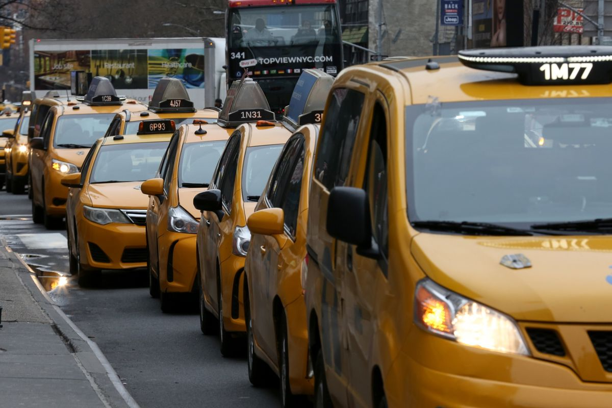

# nyc-taxi-fare-prediction
NYC taxi fare prediction is a task that involves using machine learning algorithms to estimate the cost of a taxi ride in New York City based on various factors such as pickup and drop-off locations, distance traveled, time of day, and other relevant factors. The goal is to accurately predict the fare amount for a given trip, which can be helpful for both passengers and drivers in planning and budgeting for transportation costs. This prediction task is typically tackled using supervised learning techniques such as regression models, which are trained on historical data to make predictions on new, unseen data. The accuracy of the predictions can be evaluated using metrics such as mean squared error or mean absolute error, and the models can be further optimized using techniques such as feature engineering, hyperparameter tuning.

